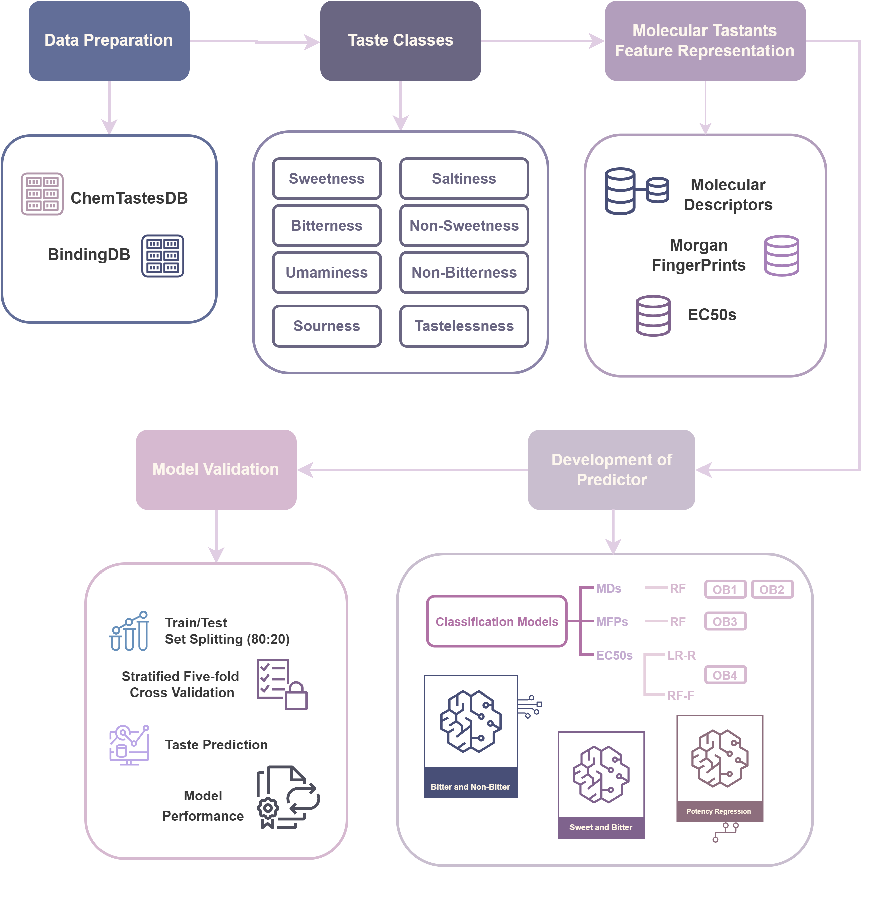

# VU Taste Prediction

Please check corresponding branches for each individual's work.

- rui: Bitter/sweet RF on small molecules
- ruizhe: Bitter/non-bitter RF on small molecules
- natalia: RF on Peptides
- minh: Regression models

Here is the workflow of this research:

